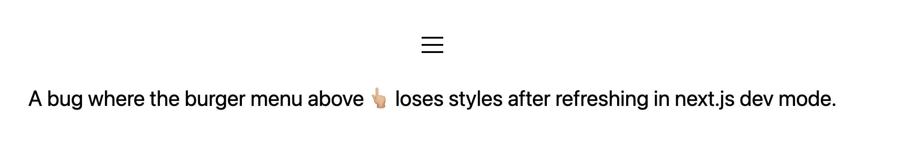
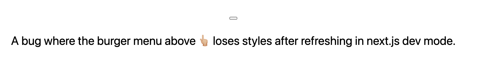

# Next.js Mantine bug

A repo to show a bug where [Mantine](https://mantine.dev/) would lose styles in next.js dev mode

See https://github.com/mantinedev/mantine/issues/53

## To replicate the bug

1. Use node version in `.tool-versions`
1. Install dependencies: `npm install`
1. Run next.js in dev mode: `npm run dev`
1. Open [http://localhost:3000](http://localhost:3000)
1. Refresh the page a couple of times

First render:



After a couple of refreshes:



The terminal console also shows:

```
Warning: [JSS] Rule is not linked. Missing sheet option "link: true".
```

## Setup of project

This project was setup using

1. Install next.js: `npx create-next-app next-mantine-bug --use-npm` - https://nextjs.org/docs
2. Install mantine: `npm install react-jss @mantine/core @mantine/hooks` - https://mantine.dev/core/getting-started/
